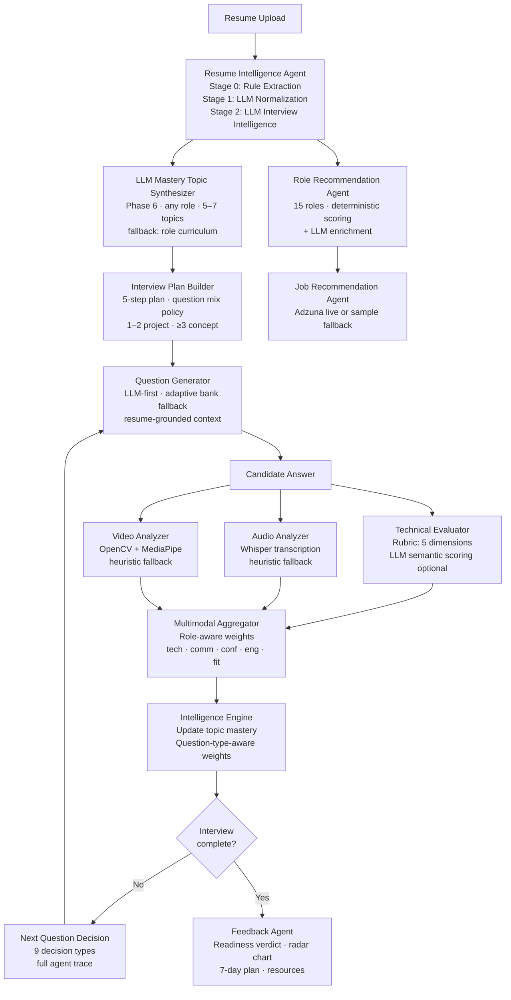

# MockInterview.ai

> An agentic, multimodal AI mock interview platform that analyzes a resume, recommends roles, conducts adaptive interviews, evaluates answers, tracks skill mastery, and delivers explainable coaching feedback.

[](https://python.org)
[](https://fastapi.tiangolo.com)
[](https://react.dev)
[](https://docker.com)
[](backend/tests/)
[](LICENSE)

---

## Table of Contents

1. [Problem Statement](#problem-statement)
2. [Solution Overview](#solution-overview)
3. [Key Features](#key-features)
4. [How the Intelligent Pipeline Works](#how-the-intelligent-pipeline-works)
5. [Intelligence Layer Deep Dive](#intelligence-layer-deep-dive)
6. [Tech Stack](#tech-stack)
7. [Project Structure](#project-structure)
8. [Quick Start — Docker (Recommended)](#quick-start--docker-recommended)
9. [Quick Start — Local Development](#quick-start--local-development)
10. [Environment Variables](#environment-variables)
11. [Demo Walkthrough](#demo-walkthrough)
12. [API Reference](#api-reference)
13. [Scoring Reference](#scoring-reference)
14. [Fallback Architecture](#fallback-architecture)
15. [Testing](#testing)
16. [Limitations](#limitations)

---

## Problem Statement

Most interview prep tools are static and generic.

- Candidates do not know which roles their resume best matches — or why.
- Generic question banks ask the same questions regardless of skill level or resume content.
- No tool adapts its questions in real time based on how well the candidate is actually performing.
- Feedback is either absent or limited to "correct / incorrect" — without explaining *what* to improve or *why*.
- Behavioral signals (confidence, clarity, engagement) are ignored entirely.

---

## Solution Overview

MockInterview.ai is an end-to-end pipeline that turns a resume upload into a personalized, adaptive interview with explainable feedback.

```
1. Upload resume (PDF / DOCX / TXT)
        │
        ▼
2. Resume Intelligence — extract skills, projects, seniority, weak areas,
   and resume claims worth verifying (e.g. "reduced latency by 40%")
        │
        ▼
3. Role Recommendation — score 15 engineering roles against the resume;
   enrich with LLM explanation of fit, gaps, and interview focus
        │
        ▼
4. Mastery Topic Synthesis — generate 5–7 interview focus areas from
   the resume + target role (LLM-powered, deterministic fallback)
        │
        ▼
5. Interview Plan — build a 5-step personalized plan:
   1–2 project/resume questions, then concept questions on weak areas
        │
        ▼
6. Adaptive Interview — ask questions, evaluate answers in real time,
   decide the next question type based on performance signals
        │
        ├── Text answer → Technical evaluator (rubric + optional LLM)
        ├── Audio recording → Whisper transcription + behavioral signals
        └── Webcam → Face analysis + engagement proxy
        │
        ▼
7. After each answer — update topic mastery, choose next question:
   increase difficulty / probe gap / recover confidence / switch topic
        │
        ▼
8. Final Report — readiness verdict, radar chart, per-question breakdown,
   skill mastery map, 7-day practice plan, curated learning resources
        │
        ▼
9. Job Recommendations — match against live job listings (Adzuna API)
   or curated sample data; ranked by skill overlap
```

Everything works without any API key. LLM features activate when configured.

---

## Key Features

| Feature | What it does | Always available? |
|---|---|---|
| **Resume Intelligence** | 3-stage pipeline: rule-based extraction → LLM normalization → LLM interview intelligence (claims to verify, interview risks, project probes) | Stage 0 always; Stages 1–2 require LLM |
| **Role Recommendation** | Scores 15 engineering roles on core skills, bonus skills, project evidence, and seniority affinity; calibrated to a realistic 65–91 band | Always (LLM adds why-fit explanation) |
| **Mastery Topic Synthesis** | Uses LLM to generate 5–7 role-specific interview topics from the resume; works for any role, not just predefined ones | Deterministic fallback always |
| **Interview Plan Builder** | Constructs a personalized 5-step plan with 1–2 project questions and at least 3 concept questions | Always |
| **Adaptive Interview Agent** | 9 decision types: `increase_difficulty`, `deeper_follow_up`, `strengthen_fundamentals`, `confidence_recovery`, `remediation`, `final_synthesis`, `switch_topic`, `verify_resume_claim`, `behavioral_probe` | Always |
| **Question Mix Policy** | Hard cap: ≤2 project/resume questions per session; ≥3 concept questions guaranteed | Always |
| **Question-Type-Aware Rubric** | Scores concept, project, follow-up, claim-verification, and behavioral answers with different criteria and weights | Always |
| **Question-Type-Aware Mastery** | Mastery updates use different observation weights by question type (behavioral = 0.00, concept = 0.45); behavioral answers never reduce technical mastery | Always |
| **Multimodal Scoring** | Blends technical score, audio confidence indicator, video engagement proxy; weights are role-aware | Always (signals degrade gracefully without Whisper/OpenCV) |
| **Agent Decision Trace** | Every question adaptation is fully explainable: Observation → Decision → Reason → Evidence → Next Action | Always |
| **Feedback Report** | Readiness verdict, radar chart, per-question breakdown, skill mastery map, 7-day practice plan, curated resources per topic | Always |
| **Job Recommendations** | Live job listings via Adzuna API with skill-match scoring; labeled LIVE vs SAMPLE | Sample always; live with Adzuna credentials |
| **Fallback-Safe Architecture** | Every LLM call has a deterministic rule-based fallback; MongoDB, Whisper, and OpenCV are all optional | Always |

---

## How the Intelligent Pipeline Works



---

## Intelligence Layer Deep Dive

### Resume Intelligence — 3-Stage Pipeline

```
Stage 0  Rule-Based Extraction       (always runs, no API key needed)
  ├─ Regex patterns for skills, education, experience, projects
  ├─ Section splitting and structure detection
  └─ Output: ResumeAnalysis with all core fields populated

Stage 1  LLM Normalization           (skipped if USE_LLM=false)
  ├─ Fixes fragmented projects (URL-only entries merged into parent)
  ├─ Normalizes abbreviations: "Node" → "Node.js", "Mongo" → "MongoDB"
  ├─ Expands pipe-separated stacks: "React | Node | Mongo"
  └─ Output: improved projects + skills (falls back to Stage 0 on failure)

Stage 2  LLM Interview Intelligence  (skipped if USE_LLM=false)
  ├─ Claims to verify — bold resume statements + a probe question for each
  ├─ Project deep-dive topics — grounded in the actual tech stack listed
  ├─ Interview risks — vague claims, tutorial-level depth signals, gaps
  └─ Output: intelligence fields added to ResumeAnalysis (never overwrites earlier stages)
```

### Role Recommendation — Scoring Pipeline

```
1. Core skill coverage     0–55  (matched_core / total_core × 55)
2. Bonus skill coverage    0–20  (matched_bonus / total_bonus × 20)
3. Project evidence scan   0–18  (+≤3 per relevant project, capped at 18)
4. Experience affinity     −5..+6 (seniority match per role)
5. Breadth bonus           0 / 3 / 6 (≥40% / ≥65% of all role skills matched)
──────────────────────────────────────────────────────────────────────
Raw score calibrated to 65–91 range with deterministic ±3 jitter per candidate+role.
LLM adds: why_fit · resume_evidence · gaps · interview_focus · realistic/stretch label.
```

### Adaptive Interview Agent — 9 Decision Types

| Decision Type | When it fires |
|---|---|
| `increase_difficulty` | Previous answer scored ≥ 75; candidate is performing strongly |
| `deeper_follow_up` | Strong answer but specific concept gaps detected |
| `strengthen_fundamentals` | Moderate score; reinforce core knowledge before advancing |
| `confidence_recovery` | Score < 50; return to accessible question to rebuild momentum |
| `remediation` | Persistent gap on the same topic across multiple answers |
| `switch_topic` | Topic coverage is complete; advance to next planned topic |
| `final_synthesis` | Last question slot; test integration of concepts |
| `verify_resume_claim` | Resume contains an unverified bold claim; probe for evidence |
| `behavioral_probe` | Communication or confidence signal is unexpectedly low |

Every decision is recorded as a full trace: **Observation → Decision → Reason → Evidence → Next Action**, shown live in the interview UI.

### Question-Type-Aware Mastery Tracking

Topic mastery (0–100) is updated after every answer using a Bayesian-style weighted update. The observation weight depends on the question type:

| Question Type | Observation Weight | Notes |
|---|---|---|
| `technical_concept` | 0.45 | Primary mastery signal |
| `final_synthesis` | 0.45 | Treated as equivalent depth |
| `technical_follow_up` | 0.40 | Slightly lower — narrower probe |
| `follow_up` | 0.40 | Same as follow-up |
| `project_deep_dive` | 0.35 | Project breadth, not concept depth |
| `claim_verification` | 0.30 | Light signal — verifying one claim |
| `verify_resume_claim` | 0.30 | Same as claim verification |
| `behavioral` | **0.00** | Never updates technical mastery |
| `behavioral_probe` | **0.00** | Never updates technical mastery |

Behavioral answers do not reduce technical mastery regardless of score. Adjacent topic propagation is also suppressed for behavioral answers.

### Rubric — 5 Evaluation Dimensions

Answers are scored against expected concept points using synonym-aware keyword matching:

| Dimension | Weight | What it measures |
|---|---|---|
| Conceptual correctness | 30 | Factual and theoretical accuracy |
| Practical application | 25 | Real-world usage and hands-on context |
| Depth and trade-offs | 20 | Nuance, alternatives, and reasoning |
| Communication structure | 15 | Clarity, examples, logical flow |
| Resume/project connection | 10 | Connecting the answer to own experience |

Project and behavioral questions use separate rubric profiles. The LLM path (when configured) adds semantic scoring and specific feedback text.

### Multimodal Scoring — Role-Aware Weights

```
Default:   technical×0.45  + communication×0.20 + confidence×0.15
           + engagement×0.10 + role_fit×0.10

Backend Developer:  technical×0.55  (higher weight — correctness matters most)
Product Manager:    technical×0.20  + communication×0.35 + confidence×0.20
                    (communication-heavy for non-engineering role)
```

| Signal | Source (real) | Source (fallback) |
|---|---|---|
| Technical score | Rubric + optional LLM evaluation | Rubric always |
| Communication indicator | Whisper speech-clarity score | Word-count heuristic |
| Confidence indicator | Whisper fluency + pause analysis | Score trajectory |
| Engagement proxy | OpenCV face-presence rate | Session-length heuristic |

Every report carries a `behavioral_mode` field: `multimodal` · `audio` · `video` · `audio_fallback` · `video_fallback` · `placeholder`. Heuristic scores are visibly distinguished from real AI-derived scores.

---

## Tech Stack

| Layer | Technologies |
|---|---|
| **Frontend** | React 18, Vite, Tailwind CSS, React Router v6, Recharts, Axios |
| **Backend** | Python 3.11+, FastAPI 0.115, Pydantic v2, Uvicorn |
| **Database** | MongoDB 7 + Motor async client · transparent in-memory fallback |
| **LLM** | Gemini 2.0 Flash (recommended) · Anthropic Claude · Groq · xAI Grok — all optional |
| **Audio** | faster-whisper · heuristic fallback always available |
| **Video** | OpenCV + MediaPipe · heuristic fallback always available |
| **Live Jobs** | Adzuna API · curated 50-listing sample fallback always shown |
| **Deploy** | Docker Compose (MongoDB + FastAPI backend + React/Nginx frontend) |

---

## Project Structure

```
MockInterview.ai/
├── backend/
│   ├── main.py                          # FastAPI app, CORS, lifespan hooks
│   ├── config.py                        # Pydantic settings (reads .env)
│   ├── requirements.txt
│   ├── agents/
│   │   ├── intelligence_engine.py       # Interview plan, mastery tracking, next-question decisions
│   │   ├── resume_agent.py              # Stage 0+1: rule extraction + LLM normalization
│   │   ├── role_agent.py                # 15-role deterministic scorer
│   │   ├── interview_orchestrator.py    # Session management, adaptive question selection
│   │   ├── evaluator_agent.py           # Per-answer technical scoring (rubric + LLM)
│   │   ├── feedback_agent.py            # Final report generation
│   │   ├── job_recommender_agent.py     # Skill-to-job matching
│   │   └── adzuna_job_fetcher.py        # Adzuna live API client
│   ├── services/
│   │   ├── rubric_service.py            # 5-dimension synonym-aware rubric scoring
│   │   ├── question_generator.py        # Resume-aware question generation (LLM + bank)
│   │   ├── llm_service.py               # resume intelligence, role enrichment
│   │   ├── llm_client.py                # Unified LLM provider (Gemini/Claude/Groq/Grok)
│   │   ├── multimodal_aggregator.py     # Role-aware weighted score blending
│   │   ├── audio_analyzer.py            # Whisper transcription + behavioral signals
│   │   ├── video_analyzer.py            # OpenCV/MediaPipe engagement proxy
│   │   ├── followup_generator.py        # Context-aware follow-up question generation
│   │   ├── semantic_scorer.py           # Embedding-based answer similarity scoring
│   │   ├── scoring_service.py           # Per-answer score computation
│   │   ├── pdf_parser.py                # PyMuPDF + python-docx text extraction
│   │   └── project_classifier.py        # Selects most relevant project per role
│   ├── models/
│   │   ├── agent_state.py               # CandidateState, InterviewPlanItem, AgentDecisionTrace
│   │   ├── analysis.py                  # ResumeAnalysis, RoleMatch, ClaimToVerify
│   │   ├── interview.py                 # Question, InterviewSession, FinalReport
│   │   └── audio.py  video.py  jobs.py  resume.py
│   ├── routes/
│   │   ├── interview_routes.py          # /api/interview/* endpoints
│   │   ├── resume_routes.py             # /api/resume/upload + analyze
│   │   ├── role_routes.py               # /api/resume/roles/:id
│   │   ├── job_routes.py                # /api/jobs/:id
│   │   └── scoring_routes.py            # /api/scoring/audio + video
│   ├── tests/                           # 319 tests, 2 skipped
│   └── database/
│       ├── connection.py                # Motor client + in-memory fallback
│       └── store.py                     # In-memory key-value store
├── frontend/
│   └── src/
│       ├── pages/
│       │   ├── ResumeUpload.jsx         # Upload + 3-stage analysis panel
│       │   ├── RoleRecommendation.jsx   # Role cards with LLM explanations
│       │   ├── JobRecommendation.jsx    # Job cards with LIVE/SAMPLE badge
│       │   ├── InterviewRoom.jsx        # Adaptive interview + Agent Trace Panel
│       │   └── FeedbackReport.jsx       # Full multimodal feedback report
│       └── components/
│           ├── AgentTracePanel.jsx      # Observation/Decision/Reason/Evidence/Next Action
│           ├── AdaptationBadge.jsx      # Named decision-type badges
│           ├── RoleCard.jsx             # Fit explanation + realistic/stretch badge
│           └── JobCard.jsx              # LIVE/SAMPLE badge + application readiness
├── docs/
│   ├── demo_script.md                   # Full presenter guide with sample answers
│   └── architecture.md                  # Detailed system architecture
├── sample_data/
│   └── sample_resume.txt                # Demo resume (Alex Morgan, 4 years experience)
├── .env.example
├── docker-compose.yml
└── README.md
```

---

## Quick Start — Docker (Recommended)

Docker is the only hard dependency. No Python or Node.js required on the host.

```bash
# 1. Clone the repository
git clone <repo-url>
cd MockInterview.ai

# 2. Copy the environment template
cp .env.example .env
# Optionally add a GEMINI_API_KEY for full LLM features (see Environment Variables)

# 3. Build and start all three services
docker compose up --build
```

| Service | URL |
|---|---|
| **Frontend** | http://localhost:5173 |
| **Backend API** | http://localhost:8000 |
| **Swagger Docs** | http://localhost:8000/docs |
| **Health Check** | http://localhost:8000/api/health |
| **MongoDB** | localhost:27017 |

The backend waits for MongoDB to pass its health check before starting. The frontend waits for the backend.

---

## Quick Start — Local Development

### Prerequisites

- Python 3.11+
- Node.js 20+
- MongoDB 7 *(optional — the app falls back to in-memory store automatically)*

### 1. Clone and configure

```bash
git clone <repo-url>
cd MockInterview.ai
cp .env.example .env
# Edit .env: set USE_LLM=true and add GEMINI_API_KEY for the full experience
```

### 2. Backend

```bash
cd backend
python -m venv .venv

# Windows
.venv\Scripts\activate
# macOS / Linux
source .venv/bin/activate

pip install -r requirements.txt

# Optional: real audio transcription via Whisper
pip install faster-whisper

# Optional: real video face analysis
pip install opencv-python mediapipe

uvicorn main:app --reload --port 8000
```

### 3. Frontend

```bash
cd frontend
npm install
npm run dev
```

App opens at **http://localhost:5173**

---

## Environment Variables

Copy `.env.example` to `.env`. Every variable is optional — the app runs fully without any of them.

```bash
# ── Database (falls back to in-memory if unreachable) ────────────────────────
MONGODB_URL=mongodb://localhost:27017
MONGODB_DB_NAME=mock_interview_db

# ── Frontend CORS origin ─────────────────────────────────────────────────────
FRONTEND_URL=http://localhost:5173

# ── LLM — set USE_LLM=true and add exactly one API key ───────────────────────
USE_LLM=false
LLM_PROVIDER=gemini              # gemini | anthropic | groq | grok

GEMINI_API_KEY=                  # console.cloud.google.com — recommended
GEMINI_MODEL=gemini-2.0-flash

ANTHROPIC_API_KEY=               # console.anthropic.com
GROQ_API_KEY=                    # console.groq.com (free tier, fast)
GROQ_MODEL=mixtral-8x7b-32768
GROK_API_KEY=                    # console.x.ai
GROK_MODEL=grok-3

LLM_TIMEOUT_SECONDS=15           # per-request timeout; 0 = no timeout

# ── Live Jobs (sample fallback shown if not configured) ───────────────────────
ADZUNA_APP_ID=                   # developer.adzuna.com
ADZUNA_APP_KEY=

# ── Frontend (Vite) ──────────────────────────────────────────────────────────
VITE_API_BASE_URL=http://localhost:8000
```

### Enabling Gemini (recommended for best results)

1. Go to [console.cloud.google.com](https://console.cloud.google.com) → APIs & Services → enable **Generative Language API**
2. Create an API key under Credentials
3. In `.env`:
   ```
   USE_LLM=true
   LLM_PROVIDER=gemini
   GEMINI_API_KEY=your-key-here
   ```

With LLM enabled, the following features activate:
- Stage 1: resume normalization and deduplication
- Stage 2: interview intelligence (claims, risks, project probes)
- Stage 3: role enrichment (why-fit explanation, resume evidence, gaps)
- Phase 6: mastery topic synthesis tailored to any target role
- Answer evaluation: semantic scoring + specific feedback text
- Question generation: resume-grounded questions instead of bank questions

---

## Demo Walkthrough

Use `sample_data/sample_resume.txt` (Alex Morgan, 4 years, Backend/Full Stack background) for a reproducible demo.

### Step 1 — Upload and analyze

Upload `sample_resume.txt`. The 3-stage pipeline runs in under 3 seconds.

Expected output (with LLM enabled):
- Skills: Python, FastAPI, React, PostgreSQL, Redis, scikit-learn, Docker, AWS
- Projects: InterviewCoach AI, PyFlow (340 stars), ML Classifier Dashboard
- Claims to verify: "reduced p99 latency by 40%", "led migration across 3 teams"
- Interview risks: ML claims may be integration-level rather than research-level

### Step 2 — Role recommendations

Top matches for Alex Morgan's resume:

| Role | Expected Score Range | Why |
|---|---|---|
| Backend Developer | ~87–91 | Strong FastAPI, PostgreSQL, Redis, system design signals |
| Full Stack Developer | ~83–88 | React + backend coverage; strong project evidence |
| ML / AI Engineer | ~74–80 | scikit-learn + Hugging Face + ML classifier project |
| Data Engineer | ~72–77 | ETL pipeline, pandas, SQLAlchemy; strong data signals |

### Step 3 — Adaptive interview (strong answer → difficulty increase)

Select **Backend Developer**. Submit this answer to the first question:

> "Indexing improves read performance by creating optimized lookup structures. A B-tree index enables O(log n) lookups instead of a full table scan. I've used composite indexes for multi-column WHERE clauses and partial indexes for filtered queries on large tables. The real trade-off is write overhead — every INSERT must maintain the index, so I always run EXPLAIN ANALYZE before adding one to confirm it's actually used by the query planner."

Expected adaptation: **`increase_difficulty`** — the agent detects depth signals (O(log n), composite vs partial indexes, EXPLAIN ANALYZE) and escalates to a harder question.

### Step 4 — Weak answer → confidence recovery

Submit this answer to the next question:

> "Indexing makes the database faster."

Expected adaptation: **`confidence_recovery`** or **`strengthen_fundamentals`** — the agent detects low depth and drops back to a more accessible question to consolidate understanding.

### Step 5 — Agent Trace Panel

After every adaptation, the Agent Trace Panel shows:

```
OBSERVATION   Technical score: 32/100 · Covered: 0/5 expected points
DECISION      confidence_recovery
REASON        Answer lacks technical depth on indexing mechanisms.
              Revisiting core concepts before advancing.
EVIDENCE      ✗ No mechanism explained
              ✗ No trade-offs mentioned
              ✗ No practical context
NEXT ACTION   Topic: Database Design · Difficulty: easy
```

---

## API Reference

### Resume

| Method | Path | Description |
|---|---|---|
| `POST` | `/api/resume/upload` | Upload PDF/DOCX/TXT → `candidate_id` + extracted text |
| `POST` | `/api/resume/analyze` | 3-stage analysis → skills, projects, intelligence fields |
| `GET` | `/api/resume/roles/{id}` | Deterministic + LLM-enriched role recommendations |

### Interview

| Method | Path | Description |
|---|---|---|
| `POST` | `/api/interview/start` | Create session → LLM topic synthesis → interview plan → first question |
| `GET` | `/api/interview/{id}` | Load existing session |
| `POST` | `/api/interview/evaluate-answer` | Score answer; returns rubric scores + feedback |
| `POST` | `/api/interview/improve-answer` | Score an improved attempt (does not increment answer count) |
| `POST` | `/api/interview/next-question` | Next question + full agent decision trace |
| `POST` | `/api/interview/final-report` | Full multimodal report |

### Jobs

| Method | Path | Description |
|---|---|---|
| `GET` | `/api/jobs/{id}` | Live (Adzuna) or sample jobs ranked by skill match |

### Scoring

| Method | Path | Description |
|---|---|---|
| `POST` | `/api/scoring/audio` | Audio blob → transcript + behavioral signals |
| `POST` | `/api/scoring/video` | Image/clip → engagement proxy + framing score |

### Health

| Method | Path | Description |
|---|---|---|
| `GET` | `/api/health` | Backend status + LLM configuration state |

---

## Scoring Reference

### Technical evaluation (per answer)

| Score | Measures | Weight in rubric |
|---|---|---|
| `conceptual_correctness` | Factual and theoretical accuracy | 30 |
| `practical_application` | Real-world usage, hands-on context | 25 |
| `depth_and_tradeoffs` | Nuance, alternatives, reasoning | 20 |
| `communication_structure` | Clarity, examples, logical flow | 15 |
| `resume_project_connection` | Connecting answer to own work | 10 |

### Overall session score

```
overall = technical   × role_weight   (0.45 default; 0.55 for Backend Developer)
        + communication × 0.20
        + confidence    × 0.15
        + engagement    × 0.10
        + role_fit      × 0.10
```

### Interview readiness verdict

| Verdict | Threshold |
|---|---|
| **Ready** | Overall ≥ 75 |
| **Almost Ready** | Overall 55–74 |
| **Needs Practice** | Overall < 55 |

---

## Fallback Architecture

The system is designed so that removing any external dependency degrades output quality gracefully but never breaks the user flow.

| Dependency | Without it | With it |
|---|---|---|
| **LLM (Gemini / Claude / etc.)** | Rule-based resume extraction, deterministic role scores, static bank questions, rubric scoring | Semantic resume normalization, interview intelligence, role enrichment, LLM question generation, semantic answer scoring |
| **MongoDB** | In-memory store (data lost on restart; single device only) | Persistent sessions across restarts and devices |
| **faster-whisper** | Audio signals estimated from file size and duration | Real Whisper transcription; confidence and clarity from actual speech |
| **OpenCV + MediaPipe** | Engagement estimated from session length | Face-presence rate, head stability, framing from webcam frames |
| **Adzuna API** | 50-listing curated sample jobs (clearly labeled SAMPLE) | Live job postings with apply links (labeled LIVE) |

---

## Testing

```bash
cd backend
python -m pytest -q
```

**319 passed, 2 skipped** across 20 test files covering:

| Test Suite | What it covers |
|---|---|
| `test_intelligence_engine.py` | Interview plan building, mastery initialization, decision logic |
| `test_mastery_update_fairness.py` | Question-type-aware observation weights, behavioral mastery skip |
| `test_phase5_integration.py` | End-to-end flows: RAG, CNN, Backend, behavioral, multimodal |
| `test_phase6_llm_mastery.py` | LLM mastery synthesis for 6 non-standard roles; dedup, trim, fallback |
| `test_rubric_service.py` | Synonym-aware rubric scoring across all 5 dimensions |
| `test_rubric_profiles.py` | Profile differences: concept vs project vs behavioral |
| `test_question_mix_policy.py` | ≤2 project / ≥3 concept enforcement |
| `test_agentic_interview_loop_integration.py` | Full 5-question adaptive loop |
| `test_evaluator_multimodal.py` | Multimodal score blending and role-aware weights |
| `test_decision_trace.py` | Agent trace structure and all 9 decision types |
| `test_dynamic_mastery_topics.py` | Resume-aware curriculum generation |
| `test_question_generator_decision_context.py` | LLM prompt construction with agent decision context |
| `test_resume_role_question_jobs.py` | Full pipeline from resume upload to job recommendations |

---

## Limitations

- **Audio signals without Whisper**: Confidence and clarity are estimated from audio file size and duration — not from real speech analysis. Install `pip install faster-whisper` for real Whisper-derived signals.
- **Video signals without OpenCV**: Engagement is estimated from session length. Install `pip install opencv-python mediapipe` for face-detection-derived signals.
- **LLM-dependent features**: Interview intelligence (claims, risks, project probes), role enrichment (why-fit explanation), and LLM mastery synthesis all require `USE_LLM=true` and a configured API key. High-quality rule-based outputs are always available without them.
- **In-memory storage**: Session data is lost on backend restart unless MongoDB is configured. `candidate_id` is stored in browser `localStorage`, so sessions do not persist across devices without MongoDB.
- **Sample jobs**: Without Adzuna credentials, job listings are curated demo data, not live postings. Cards are labeled SAMPLE and a banner is shown.
- **Session length**: Each interview session is fixed at 5 questions. The adaptive logic selects the best 5 questions from an unlimited pool, but the session itself does not extend.

---

## Adding a New Interview Role

1. Add a role definition to `backend/agents/role_agent.py` (`_ROLES` list) with core skills, bonus skills, project signals, seniority affinities, and next-skill recommendations.
2. Optionally add a curriculum entry to `backend/agents/intelligence_engine.py` (`_ROLE_CURRICULUM`) for the deterministic question-topic fallback. If omitted, Phase 6 LLM synthesis covers the role automatically.
3. Add a title mapping to `frontend/src/components/JobCard.jsx` (`mapToInterviewRole`) so job cards link to the right interview role.

---

*Built for hackathon demonstration of agentic AI applied to interview preparation.*
